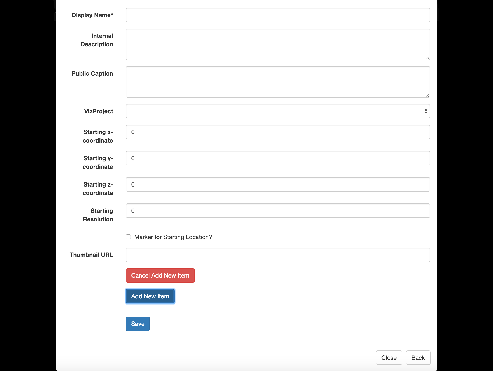

.. _dataviews:

DataViews
*********

Creating a DataView
~~~~~~~~~~~~~~~~~~~

Recall, DataViews are collections of VizProjects. Public DataViews are displayed when clicking the *Data* tab in the navbar. Additionally, when viewing a VizProject, all associated public DataViews are displayed in the *DataViews* tab in the navbar.

.. image:: images/adddataview.png

*Basic Information*

* **Name**: A friendly name for the DataView. Since the token (accessor) for the DataView is different from the name, this field may contain spaces.
* **Description**: A short description for the DataView. The description is listed wherever the DataView is displayed.
* **Public**: If checked, the DataView will appear when clicking *Data* in the navbar and in the *public_datasets* list. Note: making a DataView public requires elevated permissions.
* **Token**: The token is the URL key for the DataView. For example, a token of *mydataview* would be accessed using the URL viz.neurodata.io/dataview/mydataview/.

*Items*

DataViews are collections of VizProjects, which are enumerated as DataView Items in the Add New DataView form.

* **Display Name**: A friendly name for the DataView Item / VizProject. Can be the name of the VizProject.
* **Internal Description**: This description will only be shown to the authenticated user (or administrators) and will be displayed on the Management Interface home screen. It is designed to help keep a large number of DataViews organized.
* **Public Caption**: Similar to the Internal Description field, but public facing and displayed on the DataView popup.
* **VizProject**: Select the VizProject that corresponds to this DataView Item.
* **Starting Coordinate**: A starting (x,y,z) coordinate and the corresponding resolution for the VizProject. NeuroDataViz defaults to half the imagesize in x,y, and z at the highest resolution. For now, these fields are required (very few projects display well at an initial coordinate of (0,0,0) at resolution 0).
* **Marker for Starting Location?**: Checking this box places a marker at the starting location when the VizProject is loaded.
* **Thumbnail URL**: A URL to a png thumbnail to display inline in the DataView.
