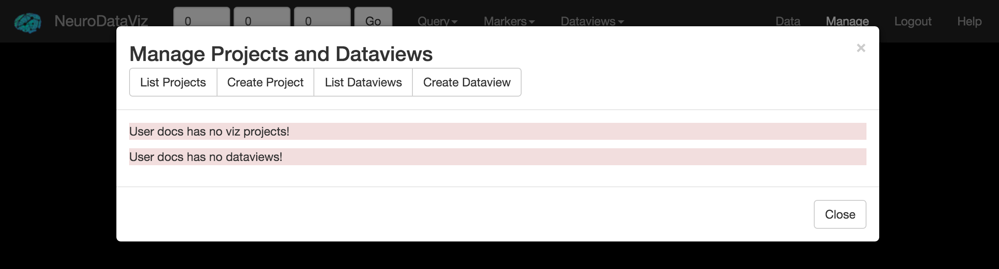

.. _manage:

Management Interface
********************

NeuroDataViz has two modes of operation:

1. **TokenView**: Allows the user to visualize any project ingested into an ndstore database by providing the token (and optionally, the channel). Properties are read directly from ndstore, and minimal customization is available by changing webargs or using onscreen tools.
2. **ProjectView**: Allows the user to create a *VizProject* consisting of arbitrary combinations of tokens / channels from ndstore. Properties, including channel color, initial starting location, and blend mode can be set by the user.

The Management Interface is primarily concerned with building *VizProjects*, which are collections of ndstore projects, and *DataViews*, which are collections of VizProjects. A user can open the Management Interface by first Logging In to NeuroDataViz using the Login button in the navbar. After logging in, a button marked *Manage* should appear in the NavBar. Clicking Manage will launch the Management Interface as an overlay on the user's current window.

Once the Management Interface loads, the user is presented with a list of VizProjects and a list of DataViews (see above).

The following example illustrates what VizProjects / DataViews might be created in a typical scenario.

.. _manage_example:

Example Usage
~~~~~~~~~~~~~

Suppose we have the following ndstore projects:

+------------------------+------------+------------+-----------+
| Project(token)         | Channel 1  | Channel 2  | Channel 3 |
+========================+============+============+===========+
| EMData                 | image      | annotation |    ...    |
+------------------------+------------+------------+-----------+
| ComputerVisionOutput   | parameter1 | parameter2 | parameter3|
+------------------------+------------+------------+-----------+

Here, these projects illustrate a typical usage pattern: some EM data is ingested into ndstore, and "ground-truth" annotations are uploaded. A computer vision algorithm is then run against the EMData image channel, generating three different annotation channels, which are each the result of some choice of parameters in the algorithm.

Now, we want to visualize the result. Many combinations are possible. But, one option might be the following:

+------------------------+------------------------+---------------------+-------------------+----------------+
| VizProject             | Layer 1 (Token / Chan) | Layer 2             | Layer 3           | Layer 4        |
+========================+========================+=====================+===================+================+
| EMDataViz              | EMData / image         | EMData / annotation |       ...         |     ...        |
+------------------------+------------------------+---------------------+-------------------+----------------+
| EMDataAlg1             | EMData / image         | EMData / annotation | CVOutput / param1 |     ...        |
+------------------------+------------------------+---------------------+-------------------+----------------+
| EMDataAlg2             | EMData / image         | EMData / annotation | CVOutput / param2 |     ...        |
+------------------------+------------------------+---------------------+-------------------+----------------+
| EMDataAlg3             | EMData / image         | EMData / annotation | CVOutput / param3 |     ...        |
+------------------------+------------------------+---------------------+-------------------+----------------+

This allows us to visualize the output of the Computer Vision algorithm (which is in a separate ndstore project) overlaid onto the original EM Data, with the original EM Annotations for comparison. Other combinations are possible. For example, we could create a VizProject with the original EM Data, the original Annotations, and all three of the Computer Vision annotation output channels. However, each VizProject layer adds increased latency to the application. Splitting a complex dataset across a few different VizProjects is always preferred, if possible.

Note that the tokens and channels for the ComputerVisionOutput ndstore project have been abbreviated in the table above. When creating a new VizProject, use the full token and channel string.

To provide a single place where a user can go to view our outputs, we create a *DataView*. Here, our DataView would consist of the following VizProjects:

* EMDataViz
* EMDataAlg1
* EMDataAlg2
* EMDataAlg3

Further documentation is available for creating :ref:`vizprojects` and :ref:`dataviews`.
