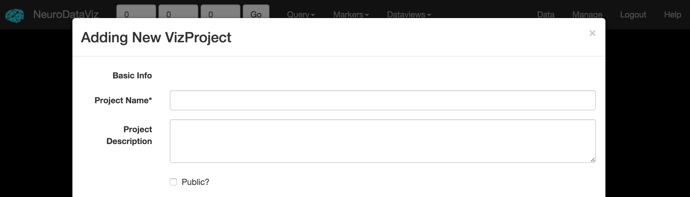
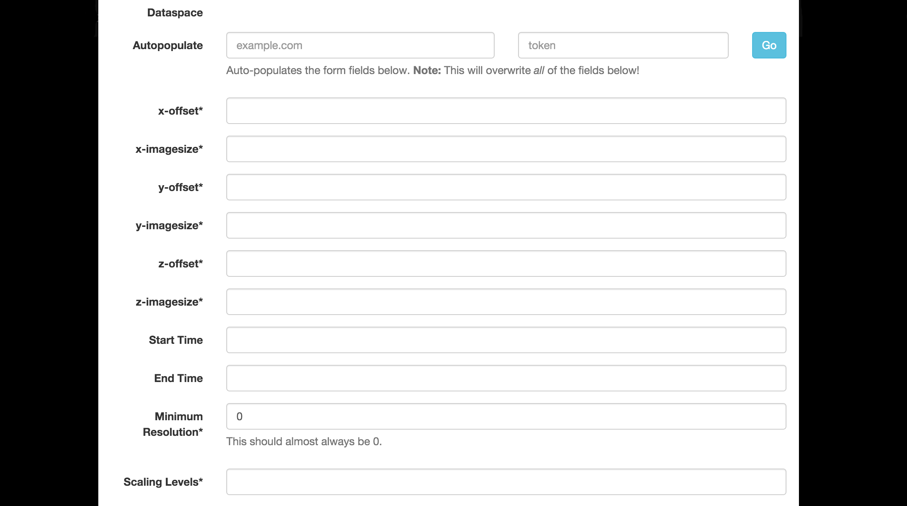
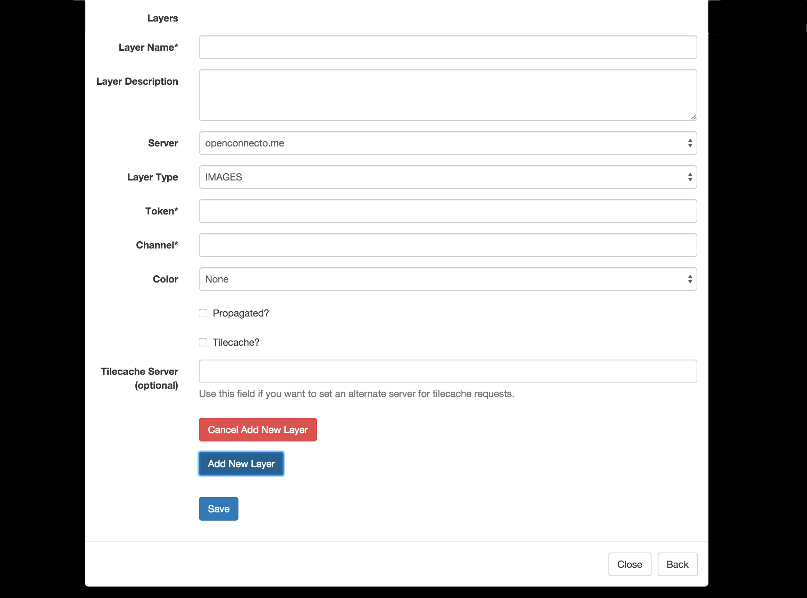

.. _vizprojects:

VizProjects
***********

Creating a VizProject
~~~~~~~~~~~~~~~~~~~~~

From the Management Interface, click the **Create Project** link in the menu bar. A description of each field is listed in the table below.

*Basic Information*

* **Project Name**: A unique name for the VizProject, which also doubles as its URL token (e.g. http://viz.neurodata.io/project/myvizproject/ would be the URL for the VizProject called *myvizproject*). As such, the Project Name can not contain spaces or special characters (other than an underscore).
* **Project Description**: A brief Project Description.
* **Public**: Currently has no effect. It is possible that private projects would be hidden from unauthenticated users in a future release.

*Dataspace*

**Autopopulate**
Since NeuroDataViz is separate from ndstore, the dataset / dataspace parameters must be input into NeuroDataViz. Since this is a tedious and error prone process, the Management Interface provides an autopopulate function that fetches dataset parameters from ndstore. Simply provide a server URL and a token for one of the ndstore projects in the dataset you want to input, click *Go*, and the Dataspace fields will be populated automatically.

* **x-offset**: The x-offset for the ndstore dataset corresponding to your token.
* **x-imagesize**: The x-imagesize for the ndstore dataset corresponding to your token.
* **y-offset**: The y-offset for the ndstore dataset corresponding to your token.
* **y-imagesize**: The y-imagesize for the ndstore dataset corresponding to your token.
* **z-offset**: The z-offset for the ndstore dataset corresponding to your token.
* **z-imagesize**: The z-imagesize for the ndstore dataset corresponding to your token.
* **Start Time**: For timeseries projects only. If time does not start at t=0, select a time offset.
* **End Time**: For timeseries projects only. The highest timestep in the dataset.
* **Minimum Resolution**: This should almost always be 0. Refer to ndstore for the correct value.
* **Scaling Levels**: The number of downsampled images in the resolution hierarchy. Note that this does not include the two upsampled zoom levels that NeuroDataViz provides. Matches the *ScalingLevels* parameter in ndstore.

*Layers*

Each layer corresponds to a token / channel combination from ndstore.

Layers can be added using the *Add New Layer* button at the bottom of the screen. New layers are only added once *Save* is clicked, and a VizProject can be created without adding new layers (should you want to save your progress as you go).

* **Layer Name**: A friendly name for the layer. This name can include spaces and some special characters.
* **Layer Description**: A short description for the layer.
* **Layer Type**: The NDV layer type corresponds to the type from ndstore.
* **Token**: The ndstore token (accessor) for the layer.
* **Channel**: The ndstore channel for the token. Even if the token only has one channel, this field is required.
* **Color**: Optional, and only for image layers, this field false colors the layer. Useful for IF data.
* **Propagated?**: If the layer has been downsampled (propagated) and the resolution hierarchy stored in ndstore, this should be checked.
* **Tilecached?**: If this option is checked, the tilecache will be used instead of the standard ndstore tiles interface. Not all ndstore installations are tilecache compatibile. If you are unsure, leave this unchecked.
* **Tilecache Server**: For advanced users. This field allows the user to set a separate tilecache server for loading images. One example use case is a multi-region ndstore deployment, where the main database system lives in one region, but tilecache servers are deployed on a local (or closer) network.
