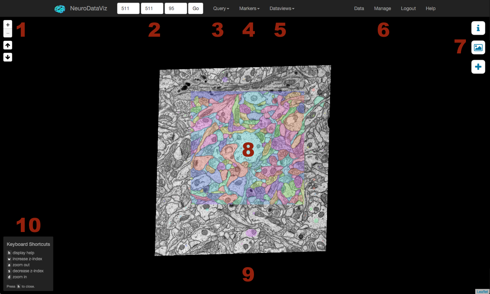
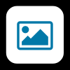

.. _viewer:

Viewer Screen
*************

Interface Overview
==================

The NeuroDataViz viewing screen displaying data from `Kristen Harris / SynapseWeb <http://openconnecto.me/synapseweb>`_. Important areas of the screen are numbered, and NeuroDataViz features corresponding to numbers are described below.

1. :ref:`zoom_and_zindex_controls`
2. :ref:`nav_controls`
3. Query Tool (see :ref:`annotations`)
4. :ref:`markers`
5. :ref:`dataviews`
6. :ref:`manage`
7. :ref:`control_panels`
8. Image Viewing Area
9. Timeseries Controls (only appearing for :ref:`timeseries`)
10. :ref:`keyboard_shortcuts`

.. _zoom_and_zindex_controls:

Zoom and Z-Index Controls
-------------------------
The `+` / `-` buttons allow you to zoom through the resolution hierarchy (see `:ref:`resolution_hierarchy). The up and down arrows allow you to travel through the dataset in z-space. If a dataset is properly bounded, a user should not be able to exceed the dataset bounds. Instead, a red outline will appear around the `z` box in the navigation controls (2, :ref:`nav_controls`).

.. _nav_controls:

Navigation Controls
-------------------

Navigation controls allow you to enter a specific `(x,y,z)` coordinate to pan/jump to. If any of the coordinates entered are outside the image bounds for the current resolution, the box corresponding to that coordinate will be outlined in red after pressing Go.

Coordinates are updated as you pan and move in z-space. The coordinates in the box correspond to the center of the map. Furthermore, the coordinates also correspond to the image dimensions **at the current image resolution**. For example, an image with native resolution of `1024 x 1024` at z-index `1` will show `(512, 512, 1)` in the navigation controls panel when viewing resolution 0 (centered), but will show `(256, 256, 1)` in the navigation controls panel when viewing resolution 1.

A thorough explanation of the resolution hierarchy treatment in NeuroDataViz is available here: :ref:`resolution_hierarchy`

.. _markers:

Markers
-------
The markers dropdown enables placing markers on the image in NeuroDataViz. Markers provide a means for data sharing. When a user clicks on a marker, a URL to that marker is automatically generated (for more see :ref:`sharing_data`, below).

Hovering over a marker also shows the `(x,y,z)` coordinates for that marker in a popup box.

Note that the `z` coordinate of a marker **will not change as you navigate in z-space**. To place a marker at the same location at a different z-space, you will need to first clear all markers (using the `Clear Markers` selection in the dropdown), and then add a new marker.

.. _control_panels:

Control / Information Panels
----------------------------

TODO proj info stuff here

TODO image controls

TODO add data

.. _keyboard_shortcuts:

Keyboard Shortcuts
------------------
Keyboard shortcuts are available to make rapidly advancing through a dataset easier. The following shortcuts are enabled:

 * `h`: hide or show help
 * `w`: increase z-index
 * `a`: zoom out
 * `s`: decrease z-index
 * `d`: zoom in

.. _sharing_data:

Sharing Data
============
TODO using markers to share data 
